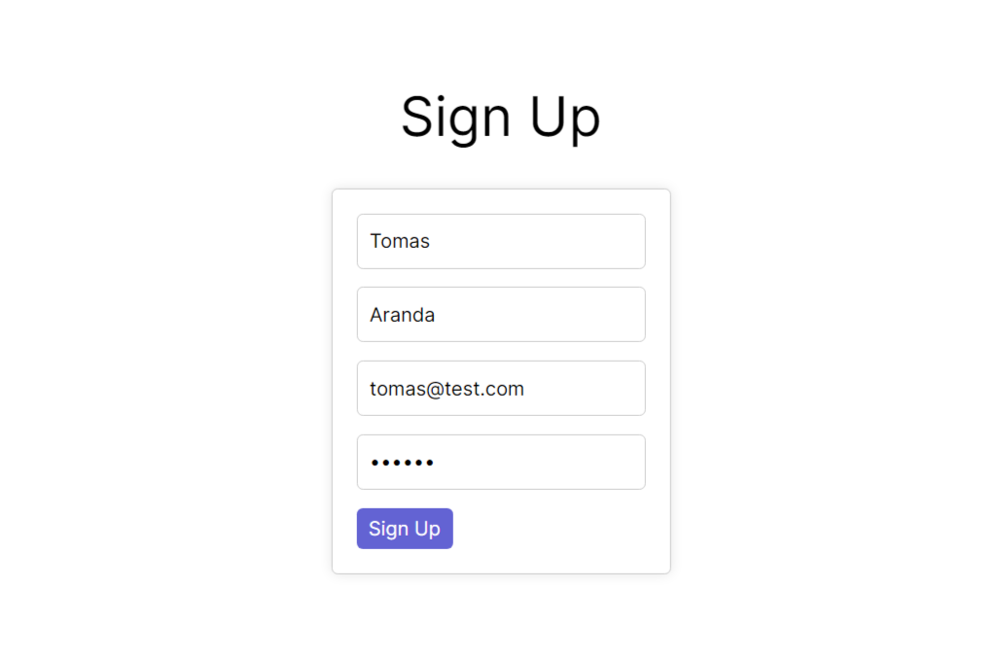

# Authentication System v1.0.0

This is a simple yet comprehensive authentication system. It's built using Next.js and TypeScript, incorporating modern web development practices. The system ensures secure user authentication and authorization features, including user registration, login, and role-based access control (RBAC). It also provides password recovery and account management functionalities for a seamless user experience. Developed with a focus on security and usability, this system is ideal for projects requiring reliable authentication mechanisms in a Next.js environment.

## 🚀 Index

📌 [Demo](#demo)
📌 [Features](#features)
📌 [Technologies Used](#technologies-used)
📌 [Getting Started](#getting-started)
📌 [How to Use](#how-to-use)
📌 [Contributing](#contributing)
📌 [License](#license)

## 🚀 Demo



## 🚀 Features

- Sign Up Page

## 🚀 Technologies Used


- **React.js**: A JavaScript library for building user interfaces.
- **Next.js**: A React framework for server-side rendering and routing.
- **TypeScript**: A statically typed superset of JavaScript for enhanced code readability and robustness.
- **CSS3**: Cascading Style Sheets for styling web pages.
- **SCSS**: Syntactically Awesome Style Sheets for advanced styling features.

## 🚀 Getting Started

1. Clone the repository:

```bash
git clone https://github.com/TomasDnlAranda/authentication-system-v1.0.0
```

2. Navigate to the project directory:

```bash
cd authentication-system-with-firebase
```

3. Install dependencies:

```bash
npm install
```

4. Start the development server:

```bash
npm run dev
```

## 🚀 How to Use

1. **Sign Up**:

   - Navigate to the _*/sign-up*_ route in your browser.
   - Open the sign-up page by clicking on the "Sign Up" link in the form to view your data.

## 🚀 Contributing

I welcome contributions to improve this authentication system. 🚀
Here's how you can contribute:

1. Fork the repository.
2. Create a new branch (`git checkout -b feature/my-feature`).
3. Make your changes and commit them (`git commit -am 'Add new feature'`).
4. Push to the branch (`git push origin feature/my-feature`).
5. Create a new Pull Request.

I appreciate your contributions!

## 🚀 License

This project is licensed under the [MIT License](https://opensource.org/licenses/MIT) - see the [LICENSE.md](LICENSE.md) file for details.
